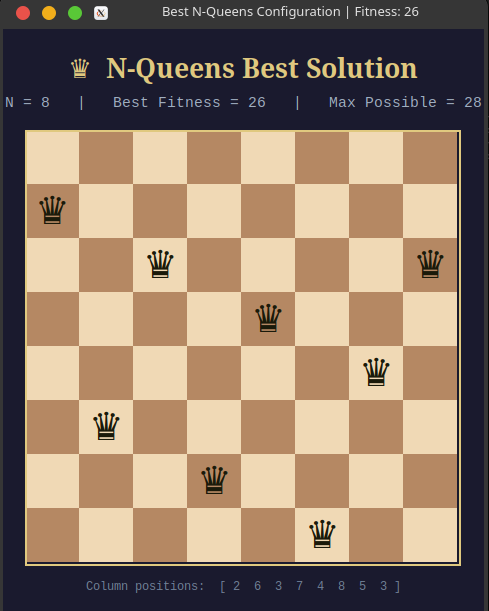
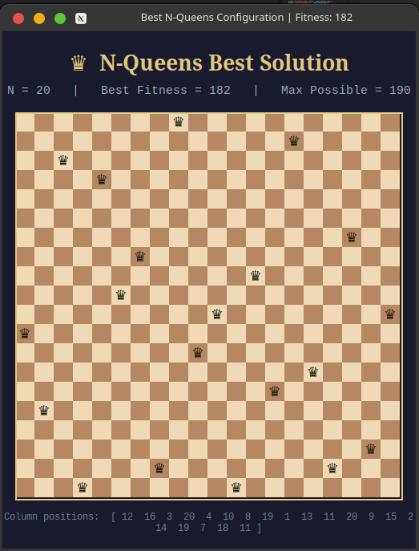

# N-Queens Genetic Algorithm Solver

This project implements a **Genetic Algorithm (GA)** to solve the classic N-Queens problem — placing N chess queens on an N×N board such that no two queens attack each other. The algorithm evolves a population of candidate solutions across multiple generations using selection, crossover, and mutation operators, tracking fitness improvements over time and visualizing the results through both a smoothed graph and an interactive Tkinter chessboard GUI.

## How It Works

Each individual in the population is represented as a list of N integers, where the value at index `i` denotes the row position of the queen in column `i`. Fitness is calculated by counting the number of non-attacking queen pairs — the maximum possible fitness for N queens is `N*(N-1)/2`. At each generation, individuals are selected proportionally to their fitness (roulette wheel selection), paired up for single-point crossover at a randomly chosen split index, and then mutated by swapping two randomly chosen positions within each individual. The algorithm tracks both the average fitness and the best fitness per generation, saving the globally best configuration encountered across all iterations. After all generations complete, a smoothed fitness graph is saved as `fitness_plot.png` and a Tkinter window opens displaying the best queen arrangement on a styled chessboard.

## Example Output

The GUI renders the best solution found across all generations on a styled chessboard. Each ♛ symbol marks the queen placed in that column, with its row determined by the best configuration the algorithm discovered. The header displays the board size, best fitness achieved, and the theoretical maximum fitness for reference.

### N = 8 (Best Fitness: 26 / 28)

> 8 queens on an 8×8 board. The algorithm found a near-optimal solution with only 2 conflicting pairs remaining. Column positions: `[2, 6, 3, 7, 4, 8, 5, 3]`



### N = 20 (Best Fitness: 182 / 190)

> 20 queens on a 20×20 board. The algorithm reached 182 out of a maximum possible 190 non-attacking pairs, placing queens across a much larger search space. Column positions: `[12, 16, 3, 20, 4, 10, 8, 19, 1, 13, 11, 20, 9, 15, 2, 14, 19, 7, 18, 11]`



As N grows, the search space expands exponentially, so the algorithm may not always reach the global optimum — but it consistently finds strong near-optimal configurations within the given number of generations. Increasing `iterations` and `p_size` for larger boards improves results significantly.

## Changing N-Queens and Iterations

To experiment with different board sizes and run lengths, modify these three variables at the bottom of the script:

```python
p_size     = 10    # Number of individuals in the population
N_queens   = 8     # Board size — change this to 4, 16, 32, 50, etc.
iterations = 500   # Number of generations to run
```

| N_queens | Recommended iterations | Recommended p_size | Notes                            |
|----------|------------------------|--------------------|----------------------------------|
| 4 – 8    | 50 – 200               | 10                 | Converges fast, easy to solve    |
| 16 – 20  | 500                    | 10 – 20            | Moderate complexity              |
| 32 – 50  | 1000+                  | 20 – 30            | Increase both for better results |

The fitness graph automatically rescales its Y-axis ticks to match the value range, so the visualization stays readable at any board size. The blue line shows average population fitness per generation and the red dashed line tracks the best individual fitness — watching the gap between them narrow indicates the population is converging.

## Installation

This project requires Python 3 and the following libraries. Install them using the exact names below:

```bash
# Core scientific and plotting libraries
pip install numpy
pip install matplotlib
pip install scipy

# Tkinter (GUI — install via system package manager, not pip)

# Arch Linux
sudo pacman -S tk

# Ubuntu / Debian
sudo apt install python3-tk tk-dev -y
```

To verify Tkinter is working correctly before running the script:

```bash
python -c "import tkinter; tkinter._test()"
```

A small test window should appear. Once all dependencies are installed, run the solver with:

```bash
python code.py
```

The script will print per-generation fitness stats to the terminal, save `fitness_plot.png` in the current directory, and open the chessboard GUI showing the best solution found.
